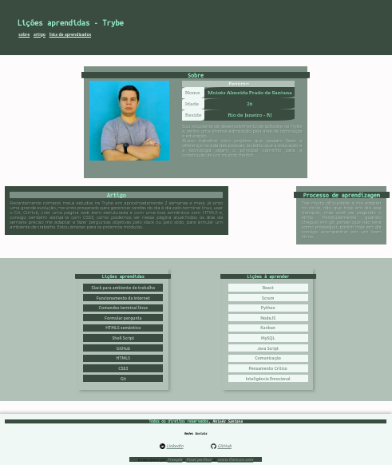

# Projeto Lessons Learned

Lessons Learned é um projeto idealizado pela Trybe onde temos como tarefa criar uma página web usando HTML5/CSS3, a pagina contém informações sobre o que aprendemos até o momento do projeto e o que estamos anciosos para aprender, e falar sobre o aprendizado adquirido durante os blocos anteriores e o atual.

## Técnologias utilizadas:

* HTML5
* CSS3

### Para visualizar basta abrir o link:

http://moisessantana.github.io/lessons-learned/
